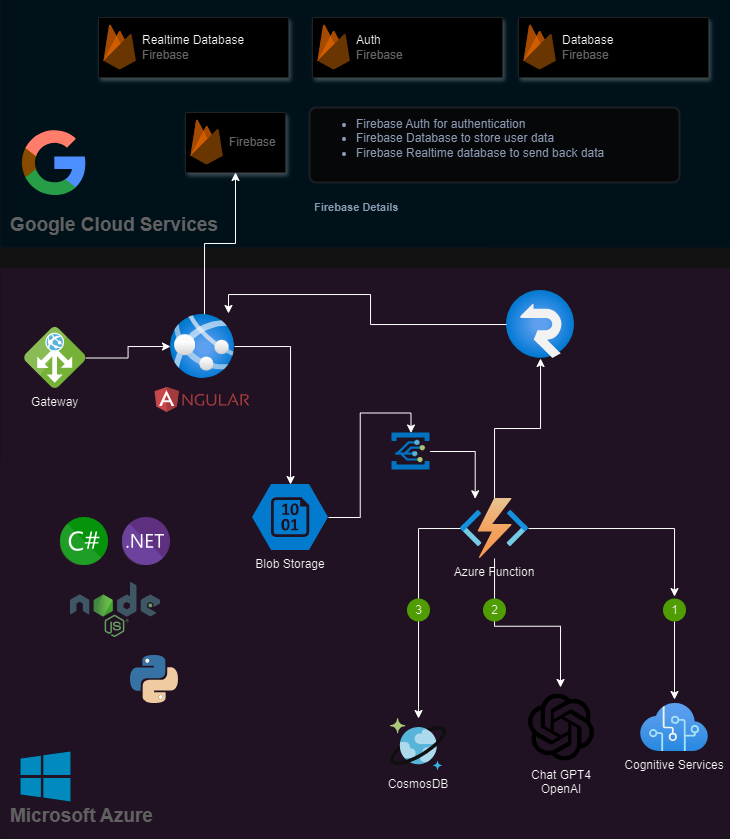

# ETL (Extract Transform & Load) system

**Based on Azure Functions Blob Storage, Cosmos DB, Document Intelligence and OpenAI**

Language|Sample code|Tutorial|
|--|--|--|
|.NET|[Sample code](dotnet)|[.NET tutorial](https://learn.microsoft.com/en-us/azure/storage/blobs/blob-upload-function-trigger?tabs=azure-portal)|
|JavaScript|[Sample code](javascript)| [JavaScript tutorial](https://learn.microsoft.com/en-us/azure/storage/blobs/blob-upload-function-trigger-javascript?tabs=storage-resource-visual-studio-code%2Ccomputer-vision-azure-portal%2Ccosmos-db-azure-portal)|
|NodeJs|[Sample code](nodejs)| [NodeJs tutorial](https://learn.microsoft.com/en-us/azure/storage/blobs/storage-blob-typescript-get-started?tabs=azure-ad)|
|Python|[Sample code](python)|[Python documentation](https://learn.microsoft.com/en-us/azure/storage/blobs/storage-blob-python-get-started?tabs=azure-ad)|


In this tutorial, you'll learn how to upload an image to Azure Blob Storage and process it using Azure Functions and Computer Vision. You'll also learn how to implement Azure Function triggers and bindings as part of this process. Together, these services will analyze an uploaded image that contains text, extract the text out of it, and then store the text in a database row for later analysis or other purposes.

You can find the full tutorial on the Microsoft Docs site. Choose the language you prefer from the table above, and then follow the tutorial to create the sample code.
[Original tutorial](https://learn.microsoft.com/en-us/azure/storage/blobs/blob-upload-function-trigger-javascript?tabs=storage-resource-visual-studio-code%2Ccomputer-vision-azure-portal%2Ccosmos-db-azure-portal)
  

## Architecture 


## Introduction

This sample code is part of a tutorial that shows you how to upload a file to Azure Blob Storage and process it using Azure Functions. The tutorial demonstrates how to create an Azure Function that is triggered by a new blob being uploaded to a container in Azure Blob Storage. The function reads the contents of the blob and logs the content to the console.

## Getting started

To get started, you must have the following prerequisites:

### Prerequisites    

Install the following tools:
- [Visual Studio Code](https://code.visualstudio.com/)
- [Azure Functions extension](https://marketplace.visualstudio.com/items?itemName=ms-azuretools.vscode-azurefunctions)
- [Azure Storage extension](https://marketplace.visualstudio.com/items?itemName=ms-azuretools.vscode-azurestorage)
- [Azure Functions Core Tools](https://docs.microsoft.com/azure/azure-functions/functions-run-local?tabs=windows%2Ccsharp%2Cbash)
- [Python](https://www.python.org/downloads/)
- [NodeJs](https://nodejs.org/)
- [Azure Storage Emulator](https://docs.microsoft.com/azure/storage/common/storage-use-emulator)
- [Azure Storage Explorer](https://azure.microsoft.com/features/storage-explorer/)
- [Azure CLI](https://docs.microsoft.com/cli/azure/install-azure-cli)


## Azure resources

You'll need the following Azure resources to complete the tutorial:
- Azure Blob Storage account
- Azure Cognitive Services account
- Azure Function app
- Cosmos DB account
- Azure OpenAI account or OpenAI account


## nodejs

The nodejs code is in the `nodejs` folder. The code is an Azure Function that is triggered by a new blob being uploaded to a container in Azure Blob Storage. The function:
  1. Reads the contents of the blob
  2. Call the Azure Document Intelligence to extract the file content
  3. Call The OpenAI CHAT gpt-4 to generate a summary of the content based on the prompt entered.

Inside the folder you will find useful scripts to create the resources needed to run the function. Specifically, you will find how to connect the private blob Storage, how to Call the Document Intelligence and how to call the OpenAI API.


### Set up

1. Clone the repository

    ```bash
    git clone
    ```
2. Open the repository in Visual Studio Code

    ```bash
    cd ./genocs-form-etl/nodejs
    code .
    ```
3. Install the required packages npm

    ```bash
    npm install
    # use the following command to install the azure functions core tools in case an error is thrown
    npm i -g azure-functions-core-tools@4.0.5801
    ```
4. Run the function locally

    ```bash
    npm run start
    ```

5. Open the Azure Storage Explorer and create a new container in the Azure Storage emulator

6. Upload a file to the container

7. Check the console output to see the contents of the uploaded file

8. Check on CosmosDB the content of the analyzed file

You can debug the function locally by setting breakpoints in the code and using the Azure Functions extension in Visual Studio Code.
When you are ready to deploy the function to Azure, you can use the Azure Functions extension to create a new function app and deploy the function to Azure.
Official documentation [here](https://docs.microsoft.com/en-us/azure/azure-functions/functions-run-local?tabs=windows%2Ccsharp%2Cbash)


## .NET

The .NET code is in the `dotnet` folder. The code is a simple Azure Function that is triggered by a new blob being uploaded to a container in Azure Blob Storage. The function reads the contents of the blob and logs the content to the console.

### Set up

1. Clone the repository

    ```bash
    git clone
    ``` 
2. Open the repository in Visual Studio Code

    ```bash
    cd ./genocs-form-etl/dotnet
    code .
    ```
3. Create a new Azure Function project

    ```bash
    func init --worker-runtime dotnet
    ```
4. Create a new Azure Function

    ```bash
    func new --name BlobTrigger --template "Blob trigger"
    ```
5. Run the function locally

    ```bash
    func start
    ``` 
6. Open the Azure Storage Explorer and create a new container in the Azure Storage emulator

7. Upload a file to the container

8. Check the console output to see the contents of the uploaded file


## Python

The python code is in the `python` folder. The code is a simple Azure Function that is triggered by a new blob being uploaded to a container in Azure Blob Storage. The function reads the contents of the blob and logs the content to the console.

### Set up

1. Clone the repository

    ```bash
    git clone
    ```
2. Open the repository in Visual Studio Code

    ```bash
    cd ./genocs-form-etl/python
    code .
    ```
3. Create a virtual environment

    ```bash
    python -m venv .venv
    ```
4. Activate the virtual environment

    ```bash
    ./.venv/Scripts/activate
    ```
5. Install the required packages

    ```bash
    pip install -r requirements.txt
    ```
6. Create a new Azure Function project

    ```bash
    func init --worker-runtime python
    ```
7. Create a new Azure Function

    ```bash
    func new --name BlobTrigger --template "Blob trigger"
    ```
8. Install the Azure Storage Blob package

    ```bash 
    pip install azure-storage-blob
    ```
9. Run the function locally

    ```bash
    func start
    ```
10. Open the Azure Storage Explorer and create a new container in the Azure Storage emulator

11. Upload a file to the container

12. Check the console output to see the contents of the uploaded file

## Resources

- [Azure Functions Python developer guide](https://docs.microsoft.com/azure/azure-functions/functions-reference-python)
- [Azure Functions triggers and bindings](https://docs.microsoft.com/azure/azure-functions/functions-triggers-bindings)
- [Azure Storage Blob package](https://pypi.org/project/azure-storage-blob/)
- [Azure Functions Core Tools](https://docs.microsoft.com/azure/azure-functions/functions-run-local?tabs=windows%2Ccsharp%2Cbash)
- [Azure Storage Emulator](https://docs.microsoft.com/azure/storage/common/storage-use-emulator)
- [Azure Storage Explorer](https://azure.microsoft.com/features/storage-explorer/)
- [Azure CLI](https://docs.microsoft.com/cli/azure/install-azure-cli)
